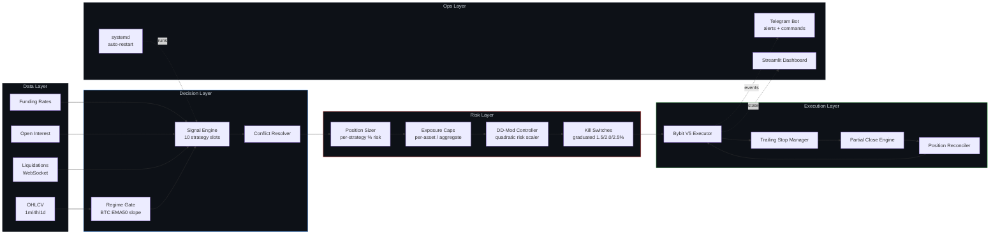

<p align="center">
  
</p>

<h1 align="center">DevAntsa Lab</h1>

<p align="center">
  <strong>Systematic crypto futures framework. Live on a $200K prop account.</strong>
</p>

<p align="center">
  
  
  
  
  
  
</p>

---

<p align="center">
  
</p>

<p align="center">
  <em>5-year walk-forward backtest, Jan 2021 → Feb 2026. Every year profitable. Live deployed.</em>
</p>

<table align="center">
<tr>
  <td align="center"><sub>SHARPE</sub><br><strong>2.23</strong></td>
  <td align="center"><sub>RETURN</sub><br><strong>+808%</strong></td>
  <td align="center"><sub>MAX DD</sub><br><strong>-12.56%</strong></td>
  <td align="center"><sub>WIN RATE</sub><br><strong>55.1%</strong></td>
  <td align="center"><sub>PROFIT FACTOR</sub><br><strong>1.76</strong></td>
  <td align="center"><sub>TRADES</sub><br><strong>1,030</strong></td>
</tr>
</table>

<p align="center">
  
</p>

<p align="center">
  <em>Monte Carlo (5,000 sims): median DD <strong>-10.20%</strong>, 95th-percentile worst DD <strong>-14.92%</strong>.</em>
</p>

---

## What This Is

A production trading framework, not a backtest demo. The repo ships the full live execution stack — exchange wrapper, regime gating, position manager, risk controls, kill switches, dashboard, Telegram bot, systemd deploy — and one example strategy. **You bring your own strategies.** The Portfolio v12 results above use proprietary strategies that stay private.

```
                           ┌─────────────┐
       Bybit V5 API   ───▶ │  OHLCV +    │ ───▶  Regime Gate (BTC EMA50 slope)
       (1m / 4h / 1d)      │  alt-data   │            │
                           └─────────────┘            ▼
                                                ┌──────────┐
                          ┌──────── Bull ◀──────│ classify │──────▶ Bear ────┐
                          │                     └──────────┘                  │
                          ▼                          │                        ▼
                    Bull strategies            Sideways strategies      Bear strategies
                    (4 LONG)                   (3 LONG range)           (3 SHORT)
                          │                          │                        │
                          └──────────────┬───────────┴────────────────────────┘
                                         ▼
                                  Conflict resolver
                                         │
                                         ▼
                              ┌──────────────────────┐
                              │ Risk manager         │
                              │   • per-strategy %   │
                              │   • per-asset cap    │
                              │   • aggregate cap    │
                              │   • DD-Mod feedback  │
                              │   • graduated halt   │
                              └──────────┬───────────┘
                                         │
                                         ▼
                                Bybit V5 executor
                                         │
                                         ▼
                              Trailing stop + partial close
```

## Architecture



## Portfolio v12 — Three Regimes, Ten Slots

The framework runs strategies that **self-gate** by regime: a bull strategy is only active when BTC is in a bull tape, etc. The full slate runs simultaneously, so the portfolio is always exposed to the right side of the market.

| # | Slot | Regime | Direction | Asset | TF | Data |
|---|------|--------|-----------|-------|----|------|
| 1 | DonchianModern | Bull | LONG | BTC | 4h | OHLCV |
| 2 | EhlersInstantTrend | Bull | LONG | SOL | 4h | OHLCV |
| 3 | VolumeWeightedTSMOM | Bull | LONG | SOL | 4h | OHLCV |
| 4 | FundingMomentumLong | Bull | LONG | ETH | 4h | Funding rate |
| 5 | CrossAssetBTCSignal | Sideways | LONG | SOL | 4h | OHLCV + cross-asset |
| 6 | DailyCCI | Sideways | LONG | SOL | 1d | OHLCV |
| 7 | EMABounce | Sideways | LONG | ETH | 4h | OHLCV |
| 8 | ExitMicroTune | Bear | SHORT | ETH | 4h | OHLCV |
| 9 | BCDExitTune | Bear | SHORT | SOL | 4h | OHLCV |
| 10 | PanicSweepOpt | Bear | SHORT | BTC | 4h | OHLCV |

> **Strategy implementations are proprietary.** This repo ships infrastructure plus one textbook example (`example_sma_crossover.py`). Bring your own.

## Risk Architecture

Risk is enforced at **four** independent layers — any one of them can stop a trade.

| Layer | Mechanism | Trigger |
|-------|-----------|---------|
| **Position** | per-strategy risk %, ATR-based stop distance | every entry |
| **Asset** | per-asset exposure cap (BTC 5% / ETH 6% / SOL 8%) | every entry |
| **Aggregate** | total open exposure cap (15%) | every entry |
| **Account** | DD-Mod feedback controller, graduated daily close-all | every tick |

**DD-Mod feedback control** (Hsieh & Barmish 2017, De Franco et al. 2020):
```
risk_scale = max(0.10, 1 − (current_DD / max_DD)²)
```
At 0% DD: full risk. At -5% DD: 75%. At -8% DD: 36%. Smooth, monotonic, guaranteed bounded DD.

**Graduated daily close-all** — winner of a 14-config sweep on 5-year data:
- `daily DD ≥ 1.5%` → close worst-losing position
- `daily DD ≥ 2.0%` → close next worst
- `daily DD ≥ 2.5%` → close ALL positions, halt new entries

Net effect on the v12 backtest: Sharpe **2.23 → 2.33**, Return **+808% → +870%**, Max DD **-12.56% → -10.01%**, worst day **-5.03% → -4.81%**. Zero free lunches; this one came close.

## Stack

```
.
├── DevAntsa_Lab/
│   ├── live_trading/
│   │   ├── engine/             main_loop · signal_engine · regime_gate
│   │   │                        position_manager · conflict_resolver
│   │   ├── execution/          bybit_executor · binance_executor
│   │   ├── strategies/         base · example_sma_crossover · (your strategies)
│   │   ├── risk/               sizing · DD-Mod · kill switches · exposure caps
│   │   ├── notifications/      telegram_notifier
│   │   ├── dashboard.py        Streamlit war-room
│   │   ├── config.py           one source of truth for all params
│   │   └── trade_journal.py    P&L matching · CSV log
│   └── RBI_Agents/             AI strategy factory (Research → Backtest → Iterate)
└── requirements.txt
```

## Bring Your Own Strategy

```python
from DevAntsa_Lab.live_trading.strategies.base import (
    StrategyBase, Signal, ExitSignal, calculate_atr, calculate_ema,
)

class MyStrategy(StrategyBase):
    name      = "MyStrategy"
    regime    = "bull"        # bull · sideways · bear
    direction = "LONG"        # LONG · SHORT
    assets    = ["BTCUSDT"]
    timeframe = "240"         # 4h candles

    def compute_indicators(self, df):
        self.compute_common_indicators(df)   # adds ATR_14
        return df

    def check_entry(self, df):
        return None  # return Signal(...) on entry

    def check_exit(self, df, position):
        return None  # return ExitSignal(...) on exit

    def calculate_trail(self, df, position):
        return None  # return updated trailing stop price
```

Register the class in `signal_engine.py` and add per-strategy config (risk %, leverage cap, asset map) in `config.py`. See `strategies/example_sma_crossover.py` for a 250-line working reference.

## Deploy

```bash
# 1.  Provision a VPS (tested: Hetzner CPX22, ~$8/mo)
ssh root@your-vps
apt update && apt install -y git python3-pip python3-venv
# Install miniconda + tflow env

# 2.  Clone + configure
git clone https://github.com/DevAntsa/DevAntsa-Algo-Public.git
cd DevAntsa-Algo-Public
cp .env_example .env  # fill in BYBIT_KEY, BYBIT_SECRET, TG_TOKEN, TG_CHAT_ID

# 3.  Boot as a service
sudo systemctl enable devantsa-loop
sudo systemctl start  devantsa-loop
journalctl -u devantsa-loop -f

# 4.  (Optional) Run dashboard locally on demand
bash run_dashboard.sh
```

Two systemd services — `devantsa-loop` (trading) and `devantsa-liq` (liquidation collector) — auto-restart on crash, auto-start on reboot.

## RBI Agent System

The Research-Backtest-Iterate factory is included. Point an LLM at a regime context, it generates strategy ideas, codes them, backtests against 5-year OHLCV, ranks on a composite score (Sharpe + Return + DD + WR), iterates the top performers, and graduates qualifiers to walk-forward validation. Used to generate the v12 slate.

## Tech

Python 3.11 · pandas · pandas-ta · numpy · backtesting.py · Bybit V5 · Streamlit · Plotly · TradingView Lightweight Charts · python-telegram-bot · systemd · Hetzner Cloud.

## Disclaimer

Backtest results are historical. Crypto futures are leveraged instruments and can lose 100% of capital. This repo is published for educational and infrastructure-reuse purposes. Trade at your own risk.

---

<p align="center">
  <a href="https://open.spotify.com/playlist/2x8w8n7ZXrLnaM3hUHw24H?si=890b85a62330461c">
    
  </a>
</p>

<p align="center">
  <sub>Built by <a href="https://github.com/DevAntsa">DevAntsa</a> · Systematic crypto trading</sub>
</p>
