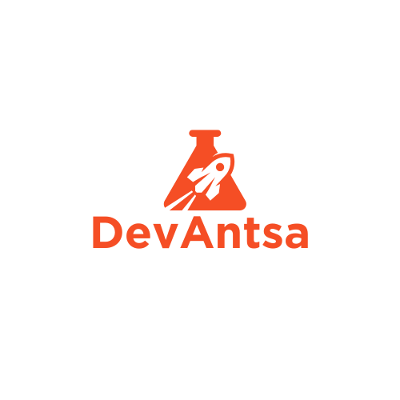

<p align="center">
  
</p>

<h1 align="center">DevAntsa Lab</h1>

<p align="center">
  <strong>Precision trading, systematic execution</strong>
</p>

<p align="center">
  
  
  
  
  
</p>

---

Automated crypto futures trading framework with regime-aware execution, walk-forward validated risk management, and full live trading infrastructure. Built for prop firm trading ($200K accounts via Bybit USDT Perpetual Futures API).

**Portfolio v12: Sharpe 2.23, +808% return, 10 strategies, 3 regimes, alt-data integration.**

**Strategy implementations are proprietary. This repo provides the full trading infrastructure -- bring your own strategies.**

## Deployment

The system is designed to run 24/7 on a cloud VPS (tested on Hetzner Cloud CPX22, ~$8/month).

| Component | How it runs | Notes |
|-----------|------------|-------|
| Trading loop | systemd service on VPS | Auto-start, auto-restart on crash |
| Liquidation collector | systemd service on VPS | WebSocket streams for BTC/ETH/SOL |
| Dashboard | Local Streamlit (on-demand) | Syncs data from server, launches locally |
| Monitoring | Telegram bot | Entry/exit alerts, commands, daily summaries |

### Server Setup
```bash
# On your VPS (Ubuntu 22.04+)
apt update && apt install -y python3-pip python3-venv git
# Install miniconda, create env, copy code, set up .env

# Create systemd service
sudo systemctl enable devantsa-loop
sudo systemctl start devantsa-loop

# View logs
journalctl -u devantsa-loop -f
```

### Dashboard (run locally, on-demand)
```bash
# Sync latest state from server + launch
bash run_dashboard.sh
```

## Architecture

```
DevAntsa_Lab/
|
|-- live_trading/               # Live execution system
|   |-- engine/                 # Core trading loop, signal engine, regime gate
|   |   |-- main_loop.py       # Dynamic tick interval, timeframe gating
|   |   |-- signal_engine.py   # Strategy iteration + signal collection
|   |   |-- regime_gate.py     # BTC EMA-50 slope classifier
|   |   |-- position_manager.py
|   |   `-- conflict_resolver.py
|   |-- execution/              # Exchange API executors
|   |   |-- binance_executor.py # Binance Futures (demo)
|   |   `-- bybit_executor.py   # Bybit V5 USDT Perpetuals (live)
|   |-- strategies/             # Strategy implementations
|   |   |-- base.py             # StrategyBase + indicator library
|   |   `-- example_sma_crossover.py  # Example strategy template
|   |-- risk/                   # Position sizing, risk management, kill switches
|   |-- notifications/          # Telegram alerts
|   |-- dashboard.py            # Streamlit war room dashboard
|   |-- config.py               # All parameters and strategy configs
|   `-- trade_journal.py        # Trade logging and P&L matching
|
`-- RBI_Agents/                 # Research-Backtest-Iterate strategy factory
    `-- RBI_Regular/            # AI-powered strategy generation + backtesting
```

## Bring Your Own Strategies

The framework ships with a textbook SMA crossover example. Build your own:

```python
# strategies/my_strategy.py
from DevAntsa_Lab.live_trading.strategies.base import (
    StrategyBase, Signal, ExitSignal, calculate_atr, calculate_ema,
)

class MyStrategy(StrategyBase):
    name = "MyStrategy"
    regime = "bull"           # "bull", "sideways", or "bear"
    direction = "LONG"        # "LONG" or "SHORT"
    assets = ["BTCUSDT"]
    timeframe = "240"         # 4h candles

    def compute_indicators(self, df):
        self.compute_common_indicators(df)  # ATR_14
        # Add your indicators here
        return df

    def check_entry(self, df):
        # Return Signal(...) when entry conditions met, else None
        return None

    def check_exit(self, df, position):
        # Return ExitSignal(...) when position should close, else None
        return None

    def calculate_trail(self, df, position):
        # Return updated trailing stop price, or None
        return None
```

Then register it:
1. Import in `signal_engine.py` and add to the strategies list
2. Add config entries in `config.py` (risk overrides, leverage caps, asset mapping)

See `strategies/example_sma_crossover.py` for a complete 250-line working example with adaptive trailing stops.

## Portfolio v12 Results (Proprietary Strategies)

10-strategy portfolio backtested on 5-year data (Jan 2021 - Feb 2026) with full portfolio management: position limits, exposure caps, risk sizing, conflict resolution, trailing stops, partial closes.

### Combined Portfolio Performance

| Metric | Value |
|--------|-------|
| **Sharpe Ratio** | **2.23** |
| **Total Return** | **+808%** ($200K -> $1.82M) |
| **Max Drawdown** | -12.56% |
| **Trades** | 1,030 |
| **Win Rate** | 55.1% |
| **Profit Factor** | 1.76 |
| **Every year profitable** | 2021-2026 |

Monte Carlo validated (5,000 simulations): median DD -10.20%, 95th worst DD -14.92%.

### Bull LONG (4 strategies)

| Strategy | Asset | Timeframe | Data |
|----------|-------|-----------|------|
| DonchianModern | BTC | 4h | OHLCV |
| EhlersInstantTrend | SOL | 4h | OHLCV |
| VolumeWeightedTSMOM | SOL | 4h | OHLCV |
| FundingMomentumLong | ETH | 4h | Alt-data (funding rates) |

### Sideways LONG (3 strategies)

| Strategy | Asset | Timeframe | Data |
|----------|-------|-----------|------|
| CrossAssetBTCSignal | SOL | 4h | OHLCV + cross-asset |
| DailyCCI | SOL | Daily | OHLCV |
| EMABounce | ETH | 4h | OHLCV |

### Bear SHORT (3 strategies)

| Strategy | Asset | Timeframe | Data |
|----------|-------|-----------|------|
| ExitMicroTune | ETH | 4h | OHLCV |
| BCDExitTune | SOL | 4h | OHLCV |
| PanicSweepOpt | BTC | 4h | OHLCV |

### v12 Key Features
- 10 strategies across 3 regimes (bull/sideways/bear) with self-gating
- Walk-forward validated: all strategies WF > 70%
- Alt-data integration: Bybit funding rates for derivatives sentiment
- Cross-asset signals: BTC recovery patterns predict SOL upside
- Optimized risk allocation with surgical per-strategy risk scaling
- Portfolio-level safety: per-asset exposure caps, aggregate risk cap
- Monte Carlo risk validation (5,000 simulations)

## RBI Agent System

The Research-Backtest-Iterate (RBI) system is an AI-powered strategy factory:

1. **Research** -- LLM generates trading strategy ideas from prompts
2. **Backtest** -- Each idea is automatically coded, backtested on 5-year OHLCV data (BTC/ETH/SOL), and scored on a composite metric (Sharpe, return, drawdown, win rate)
3. **Iterate** -- Top performers are optimized over 6 iterations with parameter sweeps
4. **Qualify** -- Strategies passing thresholds graduate to `winners/`
5. **Deploy** -- Sweep optimization and walk-forward validation before adding to live portfolio

## Live Trading Features

- **3-regime system**: Bull strategies go long, sideways strategies capture range, bear strategies go short. All self-gate via SMA200.
- **Risk management**: Per-strategy risk overrides, global risk scale (85%), phase-based leverage, daily DD halt (3%), total DD kill switch (7%).
- **Portfolio safety**: Per-asset exposure caps (5-6%), aggregate exposure cap (15%), DD-budget leverage optimization.
- **Exchange safety**: Fill verification on every order, position reconciliation every tick, atomic stop modification (place-first-then-cancel).
- **Cloud deployment**: systemd services on VPS, auto-restart on crash, auto-start on reboot.
- **Dashboard**: Streamlit war room with TradingView live charts, glassmorphism UI, equity curve, strategy grid.
- **Telegram**: Entry/exit alerts, daily summaries, command interface (/positions, /status, /stats).

## Risk Controls

| Control | Personal Limit | CFT Limit | Buffer |
|---------|---------------|-----------|--------|
| Daily drawdown | 3% | 5% | +2% |
| Total drawdown | 7% | 10% | +3% |
| Leverage | 1-1.5x | 100x | 98.5x |
| Global risk scale | 0.85x | -- | 15% haircut |
| Per-asset cap | 5-6% | -- | Concentration protection |

## Setup

```bash
# Clone
git clone https://github.com/DevAntsa/DevAntsa-Algo-Public.git
cd DevAntsa-Algo-Public

# Environment
conda create -n tflow python=3.11
conda activate tflow
pip install -r requirements.txt

# Configuration
cp .env_example .env
# Edit .env with your API keys (Binance, Telegram)

# Run live trading (locally or on VPS)
python -m DevAntsa_Lab.live_trading.engine.main_loop

# Run dashboard (separate terminal)
streamlit run DevAntsa_Lab/live_trading/dashboard.py
```

## Tech Stack

- **Python 3.11** with backtesting.py, pandas, pandas_ta, numpy
- **Bybit V5 API** (USDT Perpetual Futures) + Binance Futures (demo)
- **Hetzner Cloud / any VPS** for 24/7 deployment (~$8/month)
- **systemd** for process management
- **Streamlit + Plotly + TradingView** for dashboard
- **Telegram Bot API** for notifications

---

<p align="center">
  <sub>Built by DevAntsa | Systematic crypto trading</sub>
</p>
