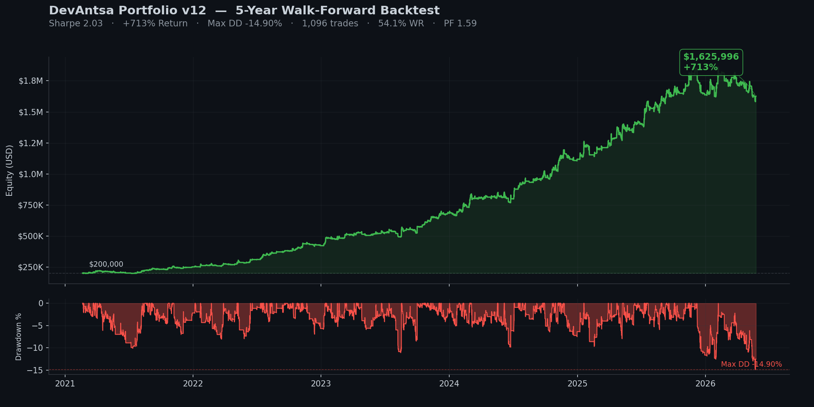
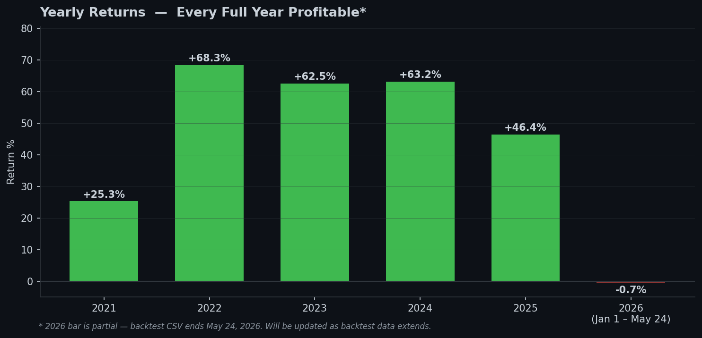
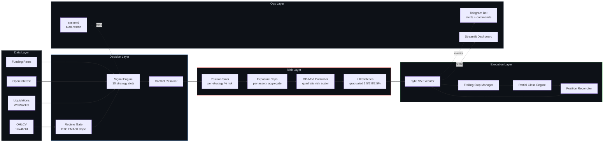

<p align="center">
  
</p>

<h3 align="center">Systematic crypto futures framework. Live on a $300K prop account stack.</h3>

<p align="center">
  
  
  
  
  
  
  
  
</p>

---

<p align="center">
  
</p>

<p align="center">
  <em>5-year walk-forward backtest, Jan 2021 → May 2026. Every full year profitable. Live deployed.</em>
</p>

<table align="center">
<tr>
  <th colspan="6" align="center">Portfolio v15 (validated 2026-05) — full slate, full sizing</th>
</tr>
<tr>
  <td align="center"><sub>SHARPE</sub><br><strong>3.03</strong></td>
  <td align="center"><sub>RETURN</sub><br><strong>+1,083%</strong></td>
  <td align="center"><sub>MAX DD</sub><br><strong>-11.00%</strong></td>
  <td align="center"><sub>YRS POSITIVE</sub><br><strong>6 / 6</strong></td>
  <td align="center"><sub>STRATEGIES</sub><br><strong>22 slots</strong></td>
  <td align="center"><sub>MC P99 DD</sub><br><strong>-53.69%</strong></td>
</tr>
<tr>
  <th colspan="6" align="center">Portfolio v12 (refreshed 2026-05-24) — 10 slots, baseline</th>
</tr>
<tr>
  <td align="center"><sub>SHARPE</sub><br><strong>2.03</strong></td>
  <td align="center"><sub>RETURN</sub><br><strong>+713%</strong></td>
  <td align="center"><sub>MAX DD</sub><br><strong>-14.90%</strong></td>
  <td align="center"><sub>WIN RATE</sub><br><strong>54.1%</strong></td>
  <td align="center"><sub>PROFIT FACTOR</sub><br><strong>1.59</strong></td>
  <td align="center"><sub>TRADES</sub><br><strong>1,096</strong></td>
</tr>
</table>

<p align="center">
  
</p>

<p align="center">
  <em>Monte Carlo (5,000 sims, v12 baseline): median DD <strong>-10.20%</strong>, 95th-percentile worst DD <strong>-14.92%</strong>.</em><br>
  <em>v15 expansion (2026-05): Sharpe lift +35%, return lift +275pp, DD <strong>improved</strong> via slot diversification.</em>
</p>

---

## What This Is

A production trading framework, not a backtest demo. The repo ships the full live execution stack — exchange wrapper, regime gating, position manager, risk controls, kill switches, dashboard, Telegram bot, systemd deploy — and one example strategy. **You bring your own strategies.** The Portfolio v12 results above use proprietary strategies that stay private.

```
                           ┌─────────────┐
       Bybit V5 API   ───▶ │  OHLCV +    │ ───▶  Regime Gate (BTC EMA50 slope)
       (1m / 4h / 1d)      │  alt-data   │            │
                           └─────────────┘            ▼
                                                ┌──────────┐
                          ┌──────── Bull ◀──────│ classify │──────▶ Bear ─────┐
                          │                     └──────────┘                   │
                          ▼                          │                         ▼
                   Bull strategies          Sideways strategies         Bear strategies
                      (11 LONG)               (10 LONG range)              (4 SHORT)
                          │                          │                         │
                          └──────────────┬───────────┴─────────────────────────┘
                                         ▼
                                 Conflict resolver
                                         │
                                         ▼
                              ┌──────────────────────┐
                              │ Risk manager         │
                              │   • per-strategy %   │
                              │   • per-asset cap    │
                              │   • aggregate cap    │
                              │   • DD-Mod feedback  │
                              │   • multi-account    │
                              │     jitter (CB70)    │
                              │   • graduated halt   │
                              └──────────┬───────────┘
                                         │
                                         ▼
                                 Bybit V5 executor
                                         │
                                         ▼
                           Trailing stop + partial close
```

## Architecture



## Portfolio Architecture — Three Regimes, 22 Slots, Full Slate Live

The framework runs strategies that **self-gate** by regime: a bull strategy is only active when BTC is in a bull tape, etc. The full slate runs simultaneously, so the portfolio is always exposed to the right side of the market.

### v12 baseline — 10 slots (deployed 2026-04-04)

| # | Slot | Regime | Direction | Asset | TF | Data |
|---|------|--------|-----------|-------|----|------|
| 1 | DonchianModern | Bull | LONG | BTC | 4h | OHLCV |
| 2 | EhlersInstantTrend | Bull | LONG | SOL | 4h | OHLCV |
| 3 | VolumeWeightedTSMOM | Bull | LONG | SOL | 4h | OHLCV |
| 4 | FundingMomentumLong | Bull | LONG | ETH | 4h | Funding rate |
| 5 | CrossAssetBTCSignal | Sideways | LONG | SOL | 4h | OHLCV + cross-asset |
| 6 | DailyCCI | Sideways | LONG | SOL | 1d | OHLCV |
| 7 | EMABounce | Sideways | LONG | ETH | 4h | OHLCV |
| 8 | ExitMicroTune | Bear | SHORT | ETH | 4h | OHLCV |
| 9 | BCDExitTune | Bear | SHORT | SOL | 4h | OHLCV |
| 10 | PanicSweepOpt | Bear | SHORT | BTC | 4h | OHLCV |

### v15 expansion — 12 slots added (deployed 2026-05-06)

| # | Slot family | Regime | Asset(s) | Mechanism | Data axis |
|---|------------|--------|----------|-----------|-----------|
| 11-13 | CB-S6 (vol-spike absorption) | Sideways | BTC/ETH/SOL | BTC 24h Z-score ≥3σ → mean-revert | Cross-asset volatility |
| 14-16 | CB-S5-ENS (on-chain ensemble) | Sideways | BTC/ETH/SOL | 6-metric on-chain divergence | blockchain.com + DefiLlama |
| 17-18 | CB-S7-v2 (funding persistence) | Bull | BTC/ETH | Sustained funding rate momentum | Bybit funding history |
| 19 | CB97-v2 (cross-asset cascade) | Sideways | SOL | ETH→SOL momentum cascade | Vol-confirmation gated |
| 20-22 | CB49_v14 (regime-rider pyramid) | Bull | BTC/ETH/SOL | 2-unit pyramid on macro-gated breakouts | FNG + ATR + RSI |

### SMC Pullback v1 — 3 cells (deployed 2026-05-08)

| # | Cell | Regime | Direction | Asset | Mechanism |
|---|------|--------|-----------|-------|-----------|
| 23 | BullSOLPullbackV1 | Bull | LONG | SOL | Pullback continuation + 1h MSS confirmation |
| 24 | BearETHPullbackV1 | Bear | SHORT | ETH | Pullback continuation + 1h MSS (regime-conditional) |
| 25 | BullBTCPullbackV1 | Bull | LONG | BTC | Pullback continuation + 1h MSS confirmation |

> **Strategy implementations are proprietary.** This repo ships infrastructure plus one textbook example (`example_sma_crossover.py`). Bring your own.

### Active sizing scalers (deployed 2026-05-07)

| Scaler | Trigger | Effect |
|--------|---------|--------|
| BE28-EMT (ETH on-chain) | ENS_DIV ≥ +3σ ±1d window | 1.5× boost on EhlersInstantTrend ETH |
| CB97-v2 cut (post-ETF inversion) | Permanent (CB104b 12σ evidence) | Reduced sizing 50% → 25% |

## Risk Architecture

Risk is enforced at **five** independent layers — any one of them can stop a trade.

| Layer | Mechanism | Trigger |
|-------|-----------|---------|
| **Position** | per-strategy risk %, ATR-based stop distance | every entry |
| **Asset** | per-asset exposure cap (BTC 5% / ETH 6% / SOL 8%) | every entry |
| **Aggregate** | total open exposure cap (18% with v15 expansion) | every entry |
| **Account** | DD-Mod feedback controller, graduated daily close-all | every tick |
| **Multi-account** | CB70 jitter spacing (1s × ACCOUNT_INDEX) | per-entry across N accounts |

**DD-Mod feedback control** (Hsieh & Barmish 2017, De Franco et al. 2020):
```
risk_scale = max(0.10, 1 − (current_DD / max_DD)²)
```
At 0% DD: full risk. At -5% DD: 75%. At -8% DD: 36%. Smooth, monotonic, guaranteed bounded DD.

**Graduated daily close-all** — winner of a 14-config sweep on 5-year data:
- `daily DD ≥ 1.5%` → close worst-losing position
- `daily DD ≥ 2.0%` → close next worst
- `daily DD ≥ 2.5%` → close ALL positions, halt new entries

Net effect on the v12 backtest: Sharpe **2.23 → 2.33**, Return **+808% → +870%**, Max DD **-12.56% → -10.01%**, worst day **-5.03% → -4.81%**. Zero free lunches; this one came close.

**Multi-account dispersion (CB70)** — running the same slate across N prop accounts produces correlated fills that stack market impact:
```
ACCOUNT_INDEX=0 → fires immediately (Account #1)
ACCOUNT_INDEX=1 → 1.0s entry offset (Account #2)
ACCOUNT_INDEX=2 → 2.0s entry offset (Account #3, future)
...up to 5 accounts
```
Net effect: combined fills approximate a TWAP rather than a single market sweep. Slippage on combined position similar to single-account, sometimes better.

## Methodology Layer (Validated R&D Rules)

The framework's value isn't just the code — it's the validated rules that prevent false-positive deploys. **20+ methodology rules banked through 130+ R&D batches:**

| Rule | What it catches |
|------|----------------|
| **Rule 1** | Edge concentration — worst-DD bars must NOT sit in the boost cell |
| **Rule 1 supplement** | Correlated stop-out check — no 3+ simultaneous stops on worst day |
| **Rule 2** | Year-stability — ≥4 of 6 yrs positive, no single year >60% of cumulative |
| **Rule 3** | Pareto delta — Sharpe ≥ baseline AND Return ≥ baseline AND DD within 1pp |
| **Rule 11** | Pre-deploy regime + correlation checks (per-year + concurrent stop-out) |
| **Rule 12** | Vision-filter blind validation (catches outcome-conditioned rubrics) |
| **Rule 13** | Launch-regime sample bias (first 30-90 days is regime-conditional, not random) |
| **All-years profitable** | HARD pre-filter — every year in sample must be profitable (4/6 fails) |
| **Calmar floor** | HARD pre-filter — Total Return % / \|Max DD %\| ≥ 10 (required at funding cap) |
| **Sharpe floor** | HARD pre-filter — annualized Sharpe ≥ 2.0 |
| **Threshold reachability** | Pre-registered Z-thresholds must be reachable against bounded/skewed proxies |
| **Overlay Δ-gate** | Overlays inherit baseline alpha — require Δ-Sharpe≥0, Δ-Return≥0, Δ-DD≤0 |
| **Exit anchor consistency** | Target + stop must share unit type (mixed pct + ATR creates vol-regime imbalance) |
| **Cross-venue timing** | Multi-venue daily strats must bar-sensitivity test to expose time-travel leaks |
| Trade-cum invalidity | DD-Mod variants must use bar-level simulation, not trade-cumulative |
| Cell-size principle | Cells > 25% of trades behave like global scalers (target < 15%) |
| Asymmetric compounding | Up-scalers compound 3× via equity feedback; down-scalers don't |

Each rule represents a real failure mode caught and codified. New strategy candidates must clear the relevant gauntlet before entering the live stack.

## Stack

```
.
├── DevAntsa_Lab/
│   ├── live_trading/
│   │   ├── engine/             main_loop · signal_engine · regime_gate
│   │   │                        position_manager · conflict_resolver
│   │   ├── execution/          bybit_executor · binance_executor (multi-account aware)
│   │   ├── strategies/         base · example_sma_crossover · (your strategies)
│   │   ├── strategies_v11/     v12 base layer (10 slots, proprietary)
│   │   ├── strategies_v15/     v15 expansion (12 slots, proprietary, _helpers shared)
│   │   ├── strategies_smc/     SMC Pullback v1 (3 cells, proprietary)
│   │   ├── risk/               sizing · DD-Mod · kill switches · exposure caps
│   │   │                        multi_account_jitter · v15_tripwires
│   │   ├── data_feeds/         onchain_metrics · deribit_dvol
│   │   ├── notifications/      telegram_notifier (account-labeled)
│   │   ├── dashboard.py        Streamlit war-room
│   │   ├── config.py           one source of truth (env-overridable)
│   │   └── trade_journal.py    P&L matching · CSV log
│   ├── scripts/
│   │   ├── health_audit_deep.py       12-check daily health audit
│   │   └── devantsa-loop-acct2.service.template  multi-account service template
│   └── RBI_Agents/             AI strategy factory (Research → Backtest → Iterate)
└── requirements.txt
```

## Bring Your Own Strategy

```python
from DevAntsa_Lab.live_trading.strategies.base import (
    StrategyBase, Signal, ExitSignal, calculate_atr, calculate_ema,
)

class MyStrategy(StrategyBase):
    name      = "MyStrategy"
    regime    = "bull"        # bull · sideways · bear
    direction = "LONG"        # LONG · SHORT
    assets    = ["BTCUSDT"]
    timeframe = "240"         # 4h candles

    def compute_indicators(self, df):
        self.compute_common_indicators(df)   # adds ATR_14
        return df

    def check_entry(self, df):
        return None  # return Signal(...) on entry

    def check_exit(self, df, position):
        return None  # return ExitSignal(...) on exit

    def calculate_trail(self, df, position):
        return None  # return updated trailing stop price
```

Register the class in `signal_engine.py` and add per-strategy config (risk %, leverage cap, asset map) in `config.py`. See `strategies/example_sma_crossover.py` for a 250-line working reference.

## Deploy

```bash
# 1.  Provision a VPS (tested: Hetzner CPX22, ~$8/mo)
ssh root@your-vps
apt update && apt install -y git python3-pip python3-venv
# Install miniconda + tflow env

# 2.  Clone + configure
git clone https://github.com/DevAntsa/DevAntsa-Algo-Public.git
cd DevAntsa-Algo-Public
cp .env_example .env  # fill in BYBIT_KEY, BYBIT_SECRET, TG_TOKEN, TG_CHAT_ID

# 3.  Boot as a service
sudo systemctl enable devantsa-loop
sudo systemctl start  devantsa-loop
journalctl -u devantsa-loop -f

# 4.  (Optional) Run dashboard locally on demand
bash run_dashboard.sh
```

Two systemd services — `devantsa-loop` (trading) and `devantsa-liq` (liquidation collector) — auto-restart on crash, auto-start on reboot.

## RBI Agent System

The Research-Backtest-Iterate factory is included. Point an LLM at a regime context, it generates strategy ideas, codes them, backtests against 5-year OHLCV, ranks on a composite score (Sharpe + Return + DD + WR), iterates the top performers, and graduates qualifiers to walk-forward validation. Used to generate the v12 slate.

## Tech

Python 3.11 · pandas · pandas-ta · numpy · backtesting.py · Bybit V5 · Streamlit · Plotly · TradingView Lightweight Charts · python-telegram-bot · systemd · Hetzner Cloud.

## Disclaimer

Backtest results are historical. Crypto futures are leveraged instruments and can lose 100% of capital. This repo is published for educational and infrastructure-reuse purposes. Trade at your own risk.

---

<p align="center">
  <a href="https://open.spotify.com/playlist/2x8w8n7ZXrLnaM3hUHw24H?si=890b85a62330461c">
    
  </a>
</p>

<p align="center">
  <sub>Built by <a href="https://github.com/DevAntsa">DevAntsa</a> · Systematic crypto trading</sub>
</p>
